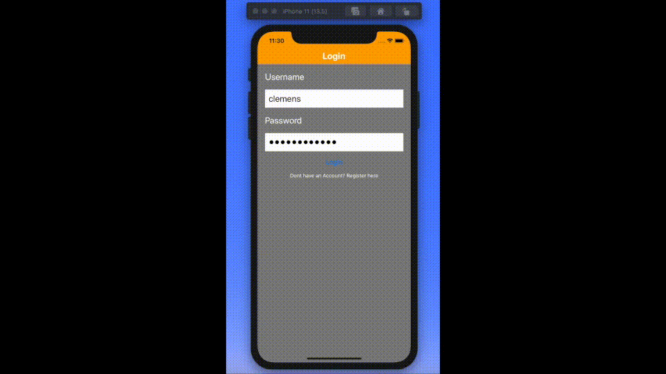

# Django-React-React-Native-Udemy-Course

Contains the code of the udemy course https://www.udemy.com/course/react-django-full-stack/. In this course a movie rating application is build using Django 2 REST API with Python 3 as backend API and a React single page web app as well as a React Native mobile app as front end. A description of the different folders as well as some pictures and gifs illustrating the general functionality are given below.

File / Folder | Description
--- | --- 
assets | images and gif for Readme
movie-rater | React single page web app for front end
MovieRater | React Native mobile app for front end 
MovieRaterAPI | Django app with Django REST as 
Readme | readme

The folders themselves are git repositorties, so they can be pushed to heroku (django) and firebase (React) for deployment.

## React web app front end

## React Nativeweb mobile app
